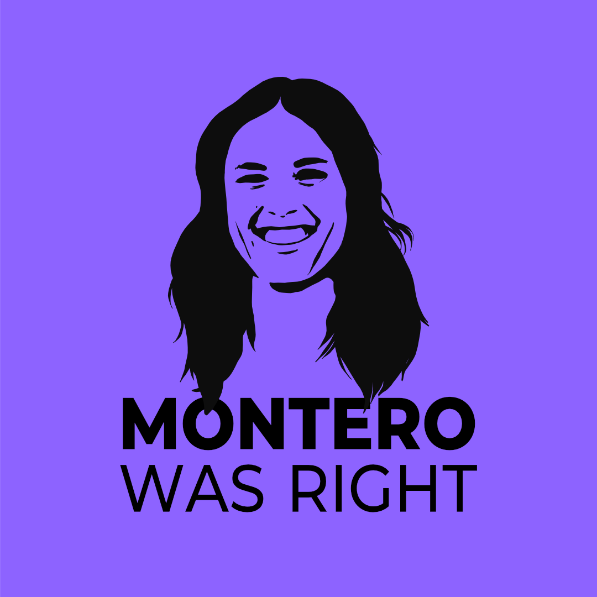
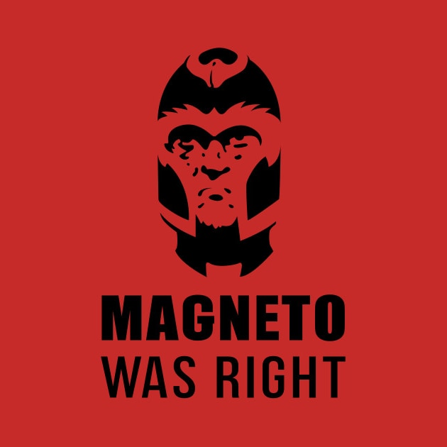

# Montero was right

Creo que hoy más que nunca tiene sentido reacondicionar la imagen de "Magneto was right" a algo más positivo. Porque tiene que decirse, y anda que no han salido señoros y presidentes en funciones a decir que si las formas, que si esto que si lo otro... pues, chates, a la vista está que **Montero Was Right**.

## Más información

- [Post original en Mastodon](https://mastodon.social/@oneeyedman/110952121226003213)
- [Foto de partida: Galería en artículo de El Español](https://www.elespanol.com/corazon/famosos/20230812/imagenes-dia-irene-montero-nunca-visto-natural-bikini-disfruta-vacaciones/786201376_3.html)
- [Origen del meme en knowyourmeme.com (EN)](https://knowyourmeme.com/memes/magneto-was-right)

### Magneto was right

## Licencia
- [ CC-BY-SA-4.0](./LICENSE)